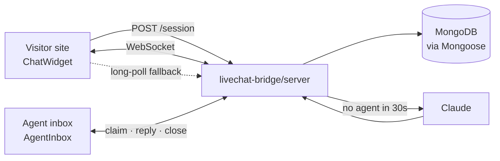

<div align="center">

# 💬 livechat-bridge

**Embeddable live chat for any website — visitor widget, agent inbox, and server, in one package.**

Drop a React component on your site, mount three route handlers, and you have a
real support channel: anonymous visitors, atomic agent claiming, file uploads,
optional Claude AI fallback, and strict `siteId` isolation so one deployment can
serve many sites.

[](./LICENSE)
[](./tsconfig.json)
[](#-transport-websocket-first-poll-always)
[](#-multi-tenancy-the-siteid-contract)

</div>

---

## Table of contents

- [Why](#why)
- [Install](#-install)
- [Quick start](#-quick-start-3-steps)
- [Visitor controls](#-visitor-controls)
- [Admin / agent controls](#-admin--agent-controls)
- [Multi-tenancy](#-multi-tenancy-the-siteid-contract)
- [Transport](#-transport-websocket-first-poll-always)
- [Server configuration](#-server-configuration)
- [Theming](#-theming)
- [Security](#-security)
- [Development](#-development)

---

## Why

Most chat widgets are a SaaS subscription and a `<script>` tag pointing at
someone else's servers. `livechat-bridge` is a **package you own**: your
database, your routes, your domain, your data.

| | |
|---|---|
| 🔓 **Anonymous-first** | Visitors chat without signing up. Pass a signed identity when you *do* know who they are. |
| 🏢 **Multi-site** | One deployment serves many websites. `siteId` scopes every query. |
| 🔌 **Three entry points** | `widget`, `server`, `admin` — import only what each side needs. |
| ⚡ **WebSocket-first** | With an automatic HTTP long-poll fallback, so it still works behind hostile proxies and on static hosts. |
| 🤖 **Optional AI** | If no agent claims a conversation in time, Claude answers — and steps aside when a human replies. |
| 📎 **Uploads** | Size- and MIME-checked, pluggable storage (S3, R2, disk). |
| 🎨 **Themeable** | CSS custom properties, dark mode, prefixed selectors that can't collide with the host page. |



---

## 📦 Install

```bash
pnpm add livechat-bridge
```

Then add only the peers you actually use — all four are **optional**:

```bash
pnpm add react react-dom      # widget + admin UI
pnpm add mongoose             # server storage
pnpm add @anthropic-ai/sdk    # AI fallback
```

---

## 🚀 Quick start (3 steps)

### 1. Mount the server routes

```ts
// app/api/livechat/[...route]/route.ts
import { createFetchRouter } from 'livechat-bridge/server';

const router = createFetchRouter({
  mongoUri: process.env.MONGODB_URI!,
  sessionSecret: process.env.LIVECHAT_SECRET!,
  allowedOrigins: ['https://your-site.com'],
  authenticateAgent: async (req) => getAgentFromSession(req), // your session system
});

export { router as GET, router as POST, router as OPTIONS };
```

One catch-all covers every route. The mount prefix is detected automatically, so
`/api/livechat`, `/chat`, or anything else works without configuration.

<details>
<summary>Prefer to mount each route yourself?</summary>

```ts
import { createRouteHandlers } from 'livechat-bridge/server';

const handlers = createRouteHandlers(config);
// handlers.session · .messages · .conversations · .claimConversation
// .closeConversation · .readConversation · .poll · .upload · .options
```

`createFetchRouter(config).handlers` exposes the same object, so you can mix a
catch-all with hand-mounted routes.

</details>

### 2. Drop the widget on your site

```tsx
'use client';
import { ChatWidget } from 'livechat-bridge/widget';
import 'livechat-bridge/widget.css';

export default function Support() {
  return (
    <ChatWidget
      siteId="acme"
      baseUrl="/api/livechat"
      title="Chat with us"
      greeting="Hi! How can we help?"
      accentColor="#7c3aed"
    />
  );
}
```

### 3. Give your staff an inbox

```tsx
'use client';
import { AgentInbox } from 'livechat-bridge/admin';
import 'livechat-bridge/admin.css';

export default function Inbox({ agent }) {
  return <AgentInbox siteId="acme" baseUrl="/api/livechat" agent={agent} />;
}
```

That's it. Visitors chat, agents answer.

---

## 👤 Visitor controls

What a person on your website can do, and the props that govern it.

### Controls in the UI

| Control | Behaviour |
|---|---|
| **Launcher bubble** | Opens and closes the chat panel. Position configurable. |
| **Pre-chat form** | Optional name + email prompt for anonymous visitors before the first message. |
| **Composer** | `Enter` sends · `Shift`+`Enter` inserts a newline. |
| **Attach file** | Uploads through your `UploadStore`, subject to size and MIME limits. |
| **Retry** | A failed send stays on screen with a retry affordance rather than vanishing. |
| **Start new conversation** | Shown once a conversation is closed; the transcript stays readable. |
| **Escape** | Closes the panel. Focus is trapped inside it while open. |

### `<ChatWidget />` props

| Prop | Type | Default | Description |
|---|---|---|---|
| `siteId` | `string` | — | **Required.** Tenant key for this website. |
| `baseUrl` | `string` | — | **Required.** Where the server routes are mounted. |
| `socketUrl` | `string` | – | WebSocket endpoint. Omit to use long-poll only. |
| `identity` | `{ id, name?, email? }` | – | Known user. Requires `identityHmac`. |
| `identityHmac` | `string` | – | HMAC proving your server vouched for `identity`. |
| `title` | `string` | `"Chat"` | Panel header. |
| `greeting` | `string` | – | First message shown before the visitor types. |
| `position` | `'bottom-right' \| 'bottom-left'` | `'bottom-right'` | Launcher placement. |
| `accentColor` | `string` | – | Overrides `--lcb-accent`. |
| `locale` | `string` | `'en'` | UI language. |

**Accessibility:** the thread is a `role="log"` with `aria-live="polite"`, every
control is labelled, focus rings are visible, and `prefers-reduced-motion` is
respected.

---

## 🎧 Admin / agent controls

The staff-facing side — a dense three-pane inbox.

```
┌──────────────┬────────────────────────────┬──────────────────┐
│ Conversations│  Thread                    │  Visitor details │
│              │                            │                  │
│ ● Open    12 │  ┌──────────────────────┐  │  Anonymous       │
│   Assigned 3 │  │ Hi, my order is late │  │  visitor #8c41   │
│   AI       1 │  └──────────────────────┘  │                  │
│   Closed  40 │        ┌───────────────┐   │  First seen 10:02│
│              │        │ Let me check… │   │  Page /checkout  │
│ ▸ Anonymous  │        └───────────────┘   │                  │
│   Jane Doe   │  ┌──────────────────────┐  │  3 prior chats   │
│   #8c41      │  │ Reply…          Send │  │                  │
└──────────────┴────────────────────────────┴──────────────────┘
```

### Controls in the UI

| Control | Behaviour |
|---|---|
| **Status filters** | `Open` · `Assigned` · `AI` · `Closed`, each with a live count. |
| **Claim** | Takes ownership. **Atomic** — if another agent wins the race you get a clear "already claimed" notice and a refreshed list, never a crash. |
| **Reply composer** | Enabled only for conversations assigned to *you*; otherwise it explains why it is disabled. |
| **Close** | Ends the conversation, with confirmation. |
| **Unread badge** | Per-conversation count of messages you have not seen. |
| **Keyboard nav** | `↑`/`↓` move through the list, `Enter` opens. The list is fully operable without a mouse. |
| **Connection status** | Shows live / polling / reconnecting, so an agent is never unknowingly offline. |

### `<AgentInbox />` props

| Prop | Type | Default | Description |
|---|---|---|---|
| `siteId` | `string` | — | **Required.** Which site's queue to show. |
| `baseUrl` | `string` | — | **Required.** Where the server routes are mounted. |
| `agent` | `Agent` | — | **Required.** The signed-in staff member. |
| `pollIntervalMs` | `number` | `25000` | Long-poll hold time. |

> **Authentication is yours.** The package never decides who is staff — you
> supply `authenticateAgent(req)` on the server and pass the resolved `agent`
> into the component. Wire it to whatever session system you already run.

---

## 🏢 Multi-tenancy: the `siteId` contract

Every persisted document carries a `siteId`, and every query filters on it.
Each schema indexes it as the **leading field** of a compound index, so tenant
scoping is also the fast path:

```ts
{ siteId: 1, status: 1, lastMessageAt: -1 }   // inbox queries
{ siteId: 1, conversationId: 1, seq: 1 }      // message pagination
```

A visitor's session token is bound to one `siteId` **and** one `visitorId`; it
cannot read another site's conversations, or another visitor's. Agents are
likewise scoped to their own site. This is covered by a dedicated test suite
(`tests/tenant-isolation.test.ts`) that seeds two sites and asserts every
handler refuses to cross the boundary.

---

## 🔀 Transport: WebSocket-first, poll always

```
connect ──▶ WebSocket ──open──▶ live
   │            │
   │          fails / closes
   │            ▼
   └──────▶ HTTP long-poll ──▶ live (degraded, still real-time enough)
```

- Reconnects use **exponential backoff with jitter**, capped and reset after a
  healthy connection.
- Every event carries a monotonic `seq`. The client resumes from its last `seq`,
  so **nothing is lost when switching between WebSocket and polling** — and
  replayed events are deduplicated rather than shown twice.
- `polling` is reported as a *healthy* state, not an error.

If you never run a WebSocket server, just omit `socketUrl`; long-poll handles
everything.

---

## ⚙️ Server configuration

```ts
createRouteHandlers({
  mongoUri: process.env.MONGODB_URI!,
  sessionSecret: process.env.LIVECHAT_SECRET!,

  // Multi-tenancy
  resolveSiteId: (req) => req.headers.get('x-site-id'),

  // Embedding — the widget runs on other origins, so be explicit
  allowedOrigins: ['https://acme.com', 'https://shop.acme.com'],

  // Staff auth — your session system, your rules
  authenticateAgent: async (req) => getAgentFromSession(req),

  // Uploads
  uploadStore: myS3Store,
  maxUploadBytes: 10 * 1024 * 1024,
  allowedMimeTypes: ['image/png', 'image/jpeg', 'application/pdf'],

  // Optional AI fallback
  ai: new AnthropicProvider({ apiKey: process.env.ANTHROPIC_API_KEY! }),
  aiFallbackMs: 30_000,
});
```

| Option | Required | Default | Notes |
|---|---|---|---|
| `mongoUri` | ✅ | — | Connection is cached across invocations for serverless. |
| `sessionSecret` | ✅ | — | HMAC key for visitor session tokens. Rotate deliberately. |
| `resolveSiteId` | – | `x-site-id` header | How a request is mapped to a tenant. |
| `allowedOrigins` | – | same-origin | CORS allow-list. Never `*` with credentials. |
| `authenticateAgent` | – | – | Required for the admin endpoints to work. |
| `uploadStore` | – | – | Omit to disable uploads entirely. |
| `maxUploadBytes` | – | `10485760` | Enforced *before* any I/O. |
| `allowedMimeTypes` | – | images, pdf, text | Enforced *before* any I/O. |
| `ai` | – | – | Omit to disable the AI fallback. |
| `aiFallbackMs` | – | `30000` | Silence before the assistant steps in. |

### Routes

These are the paths the widget and inbox call. `createFetchRouter` maps them for
you; this table is here for anyone mounting by hand or proxying.

| Method | Path | Who | Purpose |
|---|---|---|---|
| `POST` | `/session` | visitor | Create or resume a session |
| `POST` | `/messages` | visitor · agent | Send a message |
| `GET` | `/messages?conversationId&after` | visitor · agent | Read a transcript |
| `GET` | `/poll?after` | visitor · agent | Long-poll for events |
| `POST` | `/upload` | visitor | Attach a file |
| `GET` | `/conversations?status` | agent | Inbox queue |
| `POST` | `/conversations/:id/claim` | agent | Atomically take ownership |
| `POST` | `/conversations/:id/close` | agent | Resolve |
| `POST` | `/conversations/:id/read` | agent | Clear the unread badge |

The claim, close, and read routes also accept `{ conversationId }` in the body
instead of the path, so either calling style works.

---

## 🎨 Theming

Both stylesheets are driven by CSS custom properties, and every selector is
prefixed (`.lcb-`, `.lcb-admin-`) so it cannot collide with the host page.

```css
:root {
  --lcb-accent: #7c3aed;
  --lcb-radius: 14px;
  --lcb-font: 'Inter', system-ui, sans-serif;
}
```

Dark mode follows `prefers-color-scheme` out of the box; motion follows
`prefers-reduced-motion`.

---

## 🔒 Security

| Surface | Treatment |
|---|---|
| **Session tokens** | HMAC-SHA256 via Web Crypto (edge-compatible, no `jsonwebtoken`). Verified with a timing-safe comparison and an expiry check. |
| **Tenant isolation** | `siteId` on every query; proven by a dedicated test suite. |
| **Visitor scope** | A token reaches only its own `siteId` + `visitorId`. |
| **Agent scope** | Agents act only within their own site. |
| **Uploads** | Size and MIME enforced before any I/O; filenames sanitised against path traversal. |
| **Cross-origin embedding** | Explicit origin allow-list; credentials are never paired with a wildcard. |
| **Claim races** | A single atomic `findOneAndUpdate` — two agents cannot both own a conversation. |

### Known limitation

A visitor's `POST /messages` may carry an `attachments[]` entry with a `url` the
visitor did not obtain from `/upload`. The fields are re-projected and capped, so
nothing extra reaches the database, and the URL is only ever shown to
participants of that one conversation — but an agent could be shown a link to an
attacker-controlled host. Signed attachment ids will close this; until then, do
not treat an attachment URL as trusted provenance.

Found something? Open a security advisory rather than a public issue.

---

## 🛠 Development

`pnpm` is invoked through corepack in this repo.

```bash
corepack pnpm install
corepack pnpm typecheck   # tsc --noEmit
corepack pnpm test        # vitest run
corepack pnpm build       # tsup → dist/ (ESM + CJS + types)
```

| Doc | For |
|---|---|
| **[docs/ADMIN.md](./docs/ADMIN.md)** | Operators — local testing, deployment, hardening, troubleshooting |
| **[docs/STATE.md](./docs/STATE.md)** | Contributors — current state and the next tasks |
| [CHANGELOG.md](./CHANGELOG.md) | Release notes |

| Path | What it is |
|---|---|
| `src/types.ts` | The shared contract binding all three entry points |
| `src/widget/` | Visitor widget — `transport.ts` holds the reconnect state machine |
| `src/server/` | Mongoose models + framework-agnostic `Request`→`Response` handlers |
| `src/admin/` | Agent inbox UI |
| `tests/` | Vitest suites, including tenant isolation and transport reconnect |

Contributions welcome — please keep `typecheck`, `test`, and `build` green, and
add a test alongside any behaviour change.

---

## License

[MIT](./LICENSE) © Md Billal Hossain
