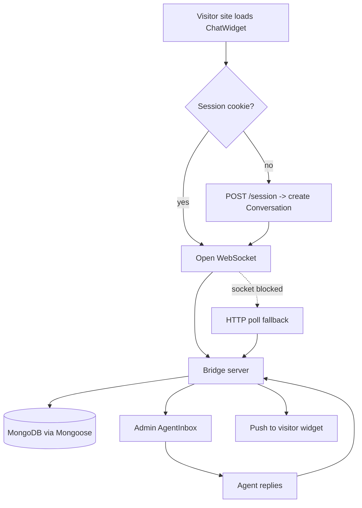

# Livechat Bridge — Embeddable Support Widget

## 1. Problem
Any website should be able to `pnpm add livechat-bridge` and get a working customer-support chat: a React widget for visitors, an admin/agent panel, and a Mongoose-backed message store. Today there is no package, no repo remote, and no onboarding docs. We also need the repo wired to `https://github.com/proffesergio/livechat-bridge.git` and a `CLAUDE.md` tuned to keep token usage low.

## 2. Approach
Ship a single pnpm workspace publishing three entry points: `livechat-bridge/widget` (React), `livechat-bridge/server` (route handlers + Mongoose models), and `livechat-bridge/admin` (agent inbox UI). Transport is WebSocket-first with an HTTP long-poll fallback so static hosts still work.

Start in **Plan Mode** and confirm the package surface with **ExitPlanMode** before any code lands. Use the **Explore subagent** (medium breadth) to map existing components and Mongoose connection helpers, then hand the multi-file design to the **Plan subagent**. Track the rollout with **TaskCreate / TaskUpdate** so each of the three packages shows progress. Run `pnpm vitest --watch` as a **background agent** while building. Store the repo conventions — pnpm only, Vitest colocated tests, no barrel re-exports — with **Auto-memory** so they survive `/clear`.

## 3. Files to change
- `package.json` — workspace config, `exports` map, `files`, `prepublishOnly`
- `src/widget/ChatWidget.tsx`, `src/widget/useChatSocket.ts`
- `src/admin/AgentInbox.tsx`, `src/admin/ConversationList.tsx`
- `src/server/models/{Conversation,Message,Agent}.ts` — Mongoose schemas + indexes
- `src/server/handlers/{messages,sessions,upload}.ts`
- `src/index.ts`, `src/types.ts`
- `tests/*.test.ts` — Vitest coverage for socket reconnect + schema validation
- `README.md`, `CLAUDE.md`, `.github/workflows/ci.yml`

## 4. Flow

## 5. Risks
Session tokens, file uploads, and cross-origin embedding are all attack surface — run **/security-review** before the first publish and again on any auth change. Unscoped Mongoose queries can leak other tenants' conversations; add a `siteId` filter and a Vitest case proving it. `git push` to the new remote should sit behind a **Permission allowlist** while `pnpm test` and `git status` run freely. Use **Worktree isolation** for the transport-fallback experiment. Before committing, run the **simplify skill**, then **/review** on the PR. Set a **PostToolUse hook** to run Prettier on every edit.

## 6. Approval
Confirm the package name, the three-entry-point split, and the Mongoose multi-tenant key before implementation starts.